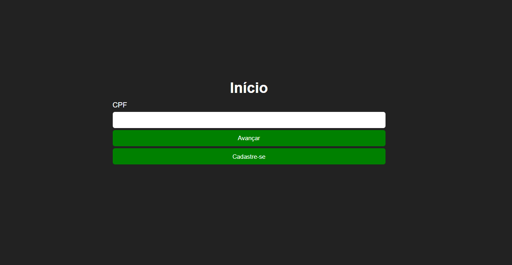

# Sistemas Web 1 - Trabalho

<p align="center">
  
</p>

## Descrição do projeto :page_with_curl: 

<p align="justify">
  Projeto desenvolvido para a disciplina Sistemas Web 1 na UFRRJ, professor Tiago Cruz. Consiste em um sistema de cadastro, login com envio de e-mail, e acesso a dados cadastrados, para exercício das competências desenvolvidas na disciplina.
</p>
* Páginas dinâmicas
* DOM
* PHP como linguagem para servidor
* MySQL e banco de dados

## Pré-requisitos

* [XAMPP](https://www.apachefriends.org/pt_br/download.html)

## Como rodar

* Abra o XAMPP e ative o **Apache** e o **MySQL**.

* Acesse https://localhost, acesse o **PHPMyAdmin**, entre na aba **SQL** e cole o conteúdo do arquivo[SQL_Query_BD.txt](./SQL_Query_BD.txt).

* No terminal, acesse o diretório **htdocs** dentro da pasta do XAMPP e clone o projeto: 

```
git clone https://github.com/trabalhoWeb1-2023/trabalho.git
```

* Acesse o sistema pela rota: https://localhost/trabalho/

## Desenvolvedores

| [<br><sub>Lucyan Ovídio</sub>](https://github.com/lucyanovidio) |  [<br><sub>Arthur de Melo</sub>](https://github.com/jvitorods)
| :---: | :---: 